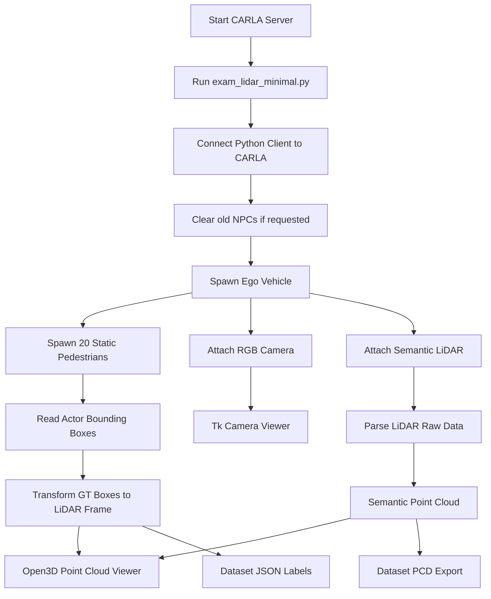

V# CARLA LiDAR Exam Reference

This document explains the exam solution in this repository. It is written as a short reference for a live defense.

## Goal

The task is to build a CARLA scene with:

- one controllable ego vehicle;
- 20 static NPC pedestrians around the ego vehicle;
- a LiDAR sensor attached to the ego vehicle;
- Open3D visualization of the point cloud;
- Ground Truth 3D Bounding Boxes;
- optional dataset export with `.pcd` point clouds and `.json` labels in a SUSTechPOINTS-like format.

The main implementation is in:

- `exam_lidar_minimal.py`
- `run_exam_lidar_minimal.sh`
- `run_exam_lidar_dataset.sh`

For setup on another computer, see `SETUP_MANUAL.md`. The Conda environment
exports are stored in `conda_env/`.

## How To Run

Start the CARLA server first:

```bash
cd /media/imit-learn/ISR_2T3/CARLA_simulator
./CarlaUE4.sh
```

Then start the exam scene in another terminal:

```bash
cd /media/imit-learn/ISR_2T3/CARLA_simulator
./run_exam_lidar_minimal.sh
```

This opens:

- a Tk camera window for driving the ego vehicle;
- an Open3D window for the semantic LiDAR point cloud;
- the normal CARLA simulator window.

Controls:

- `W` or `Arrow Up`: drive forward;
- `S` or `Arrow Down`: brake, then reverse;
- `A` or `Arrow Left`: steer left;
- `D` or `Arrow Right`: steer right;
- `Space`: hand brake;
- `Esc`: quit;
- `L`: save a dataset frame when dataset mode is enabled.

## Dataset Export

Run the dataset launcher:

```bash
./run_exam_lidar_dataset.sh
```

This mode disables Open3D for stability and automatically saves the first available LiDAR frame. Extra frames can be saved with `L`.

Output structure:

```text
exam_dataset/
  lidar/
    000000.pcd
  label/
    000000.json
```

Check the result:

```bash
ls -lh exam_dataset/lidar exam_dataset/label
head -20 exam_dataset/lidar/000000.pcd
python -m json.tool exam_dataset/label/000000.json | head -80
```

The current verified result is:

```text
labels: 20
types: ['Pedestrian']
```

## Main Components

`spawn_ego_vehicle()`

Creates one ego vehicle from the CARLA blueprint library. The vehicle role name is set to `hero`.

`spawn_static_people()`

Creates static pedestrians near the ego vehicle. The current default exam setup keeps them within `10 m` from the ego vehicle, with a minimum distance of `2 m`. The script tries navigation points first. If there are not enough points, it uses fallback positions around the vehicle.

`CameraSensor`

Creates an RGB camera attached to the ego vehicle. The first frame is also saved as `debug_exam_camera_first_frame.png` for debugging.

`SemanticLidar`

Creates a semantic LiDAR attached to the ego vehicle. Semantic LiDAR gives both point coordinates and object tags. The point cloud is downsampled before visualization to reduce lag.

`Open3DView`

Shows the LiDAR point cloud in Open3D. It can also display Ground Truth 3D Bounding Boxes as yellow line boxes.

## How GT 3D Boxes Are Built In Open3D

The Ground Truth 3D boxes are not detected from the point cloud. They are taken directly from CARLA actor metadata:

1. For each spawned pedestrian, read `actor.bounding_box`.
2. Build the 8 local box corners from `bbox.extent`.
3. Transform those corners from bounding-box local coordinates to actor coordinates.
4. Transform them from actor coordinates to world coordinates.
5. Transform them from world coordinates to the LiDAR sensor frame.
6. Negate the Y axis so the boxes match the Open3D point cloud convention.
7. Connect the 8 corners with 12 edges and draw them as an Open3D `LineSet`.

In this repository that logic is implemented in:

- `actor_bbox_vertices_in_lidar()`
- `build_bbox_lineset_data()`
- `Open3DView.tick()`

So during the defense you can say that the point cloud is sensor data, while the yellow 3D boxes are simulator ground truth projected into the LiDAR frame.

## Why LiDAR Can Look Split In Half

If the LiDAR image looks incomplete or like two separate halves, the first thing to check is synchronization between:

- `fixed_delta_seconds`
- `lidar_rotation_frequency`

One full LiDAR revolution per simulation tick gives the cleanest frame for visualization. In the current launcher:

- `--fixed-delta-seconds 0.1`
- `--lidar-rotation-frequency 10`

This is synchronized because `1 / 0.1 = 10 Hz`.

If you use `--fixed-delta-seconds 0.05`, then a matching LiDAR frequency would usually be `20 Hz`.

Other possible reasons for a broken or discontinuous scan:

- Open3D updates are slower than incoming LiDAR frames.
- `points_per_second` is too low, so the sweep looks sparse.
- only one partial sweep is shown instead of accumulated frames;
- the ego vehicle or objects move during a sweep, causing motion distortion;
- downsampling removes too many points for the viewer;
- async settings or mixed tick timing cause sensor/viewer desynchronization.

## Possible Demo Problems

The most realistic issues during a live demo are:

- Open3D window opens slowly or crashes on a weaker machine.
- A different Python environment cannot import CARLA or Open3D.
- The LiDAR sweep looks sparse or visually torn because of frequency/timestep mismatch.
- Some pedestrians fail to spawn if the current map area has poor nearby navigation points.
- Ground truth boxes may disappear if Open3D rejects the `LineSet` update.
- The camera window works, but keyboard focus is on another window.

Simple backup plan for the demo:

- run `./run_exam_lidar_minimal.sh --no-open3d` if Open3D is unstable;
- run `./run_exam_lidar_minimal.sh --hide-gt-boxes` if only the GT boxes are problematic;
- use `./run_exam_lidar_dataset.sh` to prove that LiDAR and labels are generated even without the live 3D viewer.

`DatasetWriter`

Writes point clouds to `.pcd` and labels to `.json`. The JSON format follows the SUSTechPOINTS idea: each object has `obj_type`, `obj_id`, `psr`, and `vertices`.

## Pipeline Diagram



## Coordinate Notes

CARLA uses its own coordinate system. Open3D uses a different convention. The script converts LiDAR points and bounding box vertices so that the point cloud and GT boxes use the same Open3D view:

- LiDAR points are read in the sensor frame;
- the Y coordinate is negated for Open3D visualization;
- actor bounding box vertices are transformed from actor space to world space, then from world space to LiDAR space;
- the same Y conversion is applied to boxes.

## Performance Notes

The first version used pygame for the camera window. CARLA produced valid camera frames, but the pygame window stayed black on this machine. The solution uses `tkinter + PIL.ImageTk` for the camera viewer.

The current default launch is tuned for stability:

- camera window: `800x450`;
- Tk update rate: `10 FPS`;
- Open3D update rate: `5 Hz`;
- Open3D max points: `30000`;
- LiDAR points per second: `100000`.

If Open3D is too slow, run:

```bash
./run_exam_lidar_minimal.sh --no-open3d
```

If the GT boxes cause Open3D issues, run:

```bash
./run_exam_lidar_minimal.sh --hide-gt-boxes
```

## What Is Already Verified

- CARLA RGB camera produces valid images.
- Tk viewer displays the driving camera.
- Keyboard control works, including reverse.
- Semantic LiDAR frame counter increases.
- Dataset export creates a non-empty `.pcd`.
- Dataset export creates a `.json` file with 20 `Pedestrian` labels.

## Exam Talking Points

The solution uses CARLA as the simulator and Python as the client. The client creates the scene, attaches sensors, receives sensor data asynchronously, and visualizes or exports the data.

Semantic LiDAR is useful because it provides ground truth information per point. For object-level ground truth, the script uses CARLA actor bounding boxes and transforms them into the LiDAR coordinate frame.

The dataset export separates point cloud data and labels. This is similar to common 3D detection datasets, where LiDAR frames and object annotations are stored as separate files.
